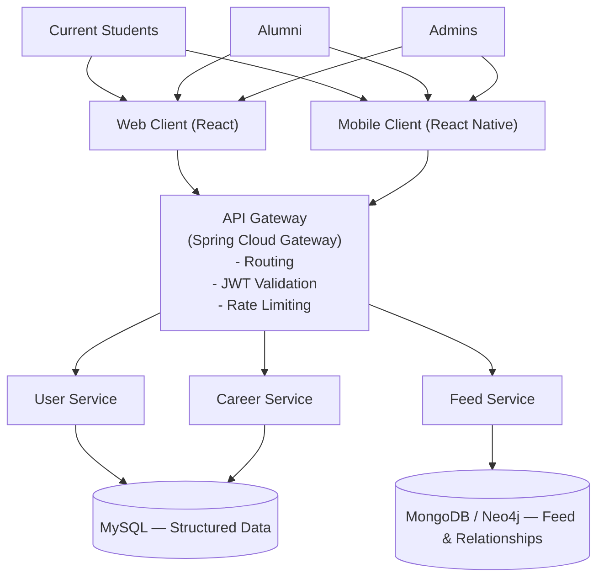

# 02 — Enterprise Architecture Diagram

## 1. Overview

This document presents the high-level Enterprise Architecture for the UniConnect platform. It follows a **top-down layered model** illustrating how user roles, client applications, integration points, microservices, and data stores are organized and interact.

## 2. Layered Architecture Summary

| Layer | Components |
|-------|------------|
| **1. Actors** | Current Students, Alumni, Admins *(with external organizations interacting through platform-managed accounts/workflows)* |
| **2. Client Access** | React Web Client, React Native Mobile Client |
| **3. API Gateway** | Spring Cloud Gateway (routing, JWT validation, rate limiting) |
| **4. Service Domain** | User Service, Feed Service, Career Service |
| **5. Data** | MySQL (structured data), MongoDB/Neo4j (feed & relationships) |

## 3. Enterprise Architecture Diagram

## 4. Layer Descriptions

### 4.1 Actors Layer

| Role | Key Interactions |
|------|-----------------|
| Current Students | View feed, apply for jobs, RSVP events |
| Alumni | Post jobs, share updates, mentor students |
| Admins | Manage users, moderate content, and support organization postings/workflows |

Actors do **not** directly access services. They interact only through client applications.

### 4.2 Client Access Layer

| Client | Technology | Purpose |
|--------|------------|---------|
| Web Client | React | Primary desktop interface |
| Mobile Client | React Native | Optimized mobile experience |

**Responsibilities:**
- UI rendering
- API request initiation
- JWT storage and handling
- Basic client-side validation

All client traffic passes through the API Gateway.

### 4.3 API Gateway / Integration Layer

**Implementation**: Spring Cloud Gateway

| Responsibility | Description |
|----------------|-------------|
| Single entry point | All external requests enter through one endpoint |
| Request routing | Routes to appropriate microservice based on URL path |
| JWT validation | Validates authentication tokens before forwarding |
| Rate limiting | Prevents abuse and ensures fair resource usage |
| Cross-cutting concerns | CORS handling, logging, error standardization |

**Justification**: Centralized security enforcement, reduced client-service coupling, and simplified service discovery.

### 4.4 Service Domain Layer

Each module is an independently deployable microservice:

| Service | Port | Responsibilities |
|---------|------|-----------------|
| User Service | 8081 | Registration, authentication, profile management, role assignment |
| Feed Service | 8082 | Post creation, feed retrieval, simplified media handling |
| Career Service | 8083 | Job/internship posting, application submission, status tracking |

**Characteristics:**
- Independently deployable
- Loosely coupled
- Communicate via REST
- Own their data stores

### 4.5 Data Layer (Polyglot Persistence)

| Database | Technology | Used For |
|----------|------------|----------|
| SQL | MySQL / Cloud SQL | Users, roles, jobs, applications, events |
| NoSQL / Graph | MongoDB Atlas / Neo4j | Feed posts, media metadata, alumni-student relationships |

**Advantages of polyglot persistence:**
- SQL provides strong consistency, relational integrity, and transaction support
- NoSQL/Graph provides flexible schema, efficient relationship traversal, and high performance for feed systems

## 5. Design Rationale

- **Layered separation** ensures that changes in one layer (e.g., adding a mobile client) do not require changes in the service or data layers.
- **Centralized gateway** prevents clients from directly accessing internal microservices, enforcing consistent security policies.
- **Polyglot persistence** allows each service to use the database technology best suited to its data model.
