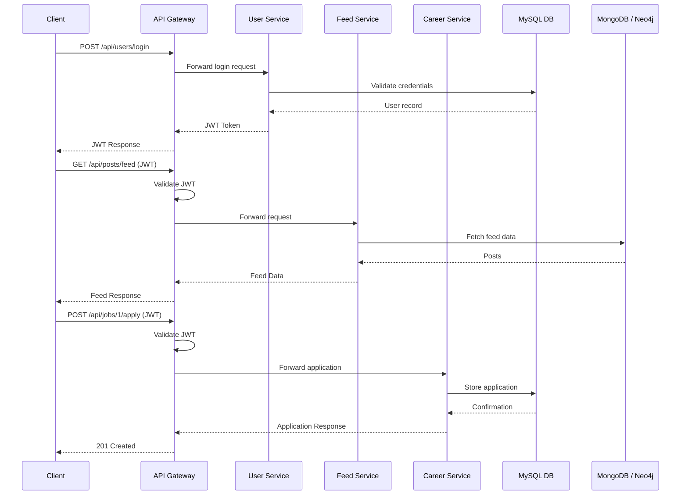
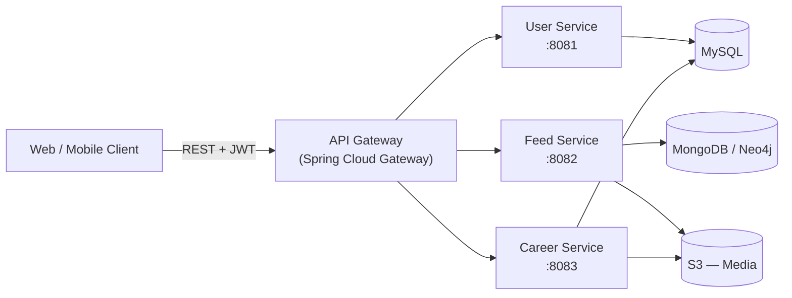

# 03 — Service-Oriented Architecture (SOA) Diagram & API Contracts

## 1. Overview

This document defines the service interaction flows and REST API contracts for the UniConnect platform. The architecture follows a **strictly RESTful** design with JWT-based authentication routed through a centralized API Gateway.

## 2. Service Interaction Flows

### 2.1 Authentication Flow

1. Client sends `POST /api/users/login` to the API Gateway.
2. API Gateway routes the request to **User Service** (port 8081).
3. User Service validates credentials against MySQL.
4. User Service issues a **JWT**.
5. Gateway returns the JWT to the client.
6. Client stores the JWT and includes it in `Authorization: Bearer <token>` header for all subsequent requests.

### 2.2 Feed Retrieval Flow

1. Client sends `GET /api/posts/feed` with JWT in the header.
2. API Gateway **validates the JWT**.
3. Gateway routes the request to **Feed Service** (port 8082).
4. Feed Service extracts the user ID from the JWT.
5. Feed Service fetches feed data from MongoDB / Neo4j.
6. Feed data is returned to the client.

### 2.3 Job Application Flow

1. Client sends `POST /api/jobs/{id}/apply` with JWT and application data.
2. API Gateway validates the JWT and routes to **Career Service** (port 8083).
3. Career Service stores the application in MySQL.
4. Career Service returns a confirmation response.

## 3. Sequence Diagram

## 4. Core API Endpoints

### 4.1 User Service (Port 8081)

| Method | Endpoint | Description | Auth |
|--------|----------|-------------|------|
| `POST` | `/api/users/register` | Create a new student/alumni account | Public |
| `POST` | `/api/users/login` | Authenticate and receive JWT | Public |
| `GET` | `/api/users/{id}/profile` | Fetch user profile details | JWT |
| `PUT` | `/api/users/{id}/profile` | Update user profile | JWT (owner) |

### 4.2 Feed Service (Port 8082)

| Method | Endpoint | Description | Auth |
|--------|----------|-------------|------|
| `GET` | `/api/posts/feed` | Retrieve the user's timeline | JWT |
| `POST` | `/api/posts` | Create a new text post | JWT |
| `GET` | `/api/posts/{id}` | Fetch a single post | JWT |
| `DELETE` | `/api/posts/{id}` | Delete a post | JWT (author) |
| `POST` | `/api/posts/{id}/likes` | Toggle like/unlike on a post | JWT |
| `POST` | `/api/posts/{id}/comments` | Add a comment to a post | JWT |

### 4.3 Career Service (Port 8083)

| Method | Endpoint | Description | Auth |
|--------|----------|-------------|------|
| `GET` | `/api/jobs` | List available jobs/internships | JWT |
| `POST` | `/api/jobs` | Create a new job posting | JWT (Alumni/Admin) |
| `GET` | `/api/jobs/{id}` | Fetch job details | JWT |
| `POST` | `/api/jobs/{id}/apply` | Submit an application | JWT (Student) |

## 5. Service Communication Summary

## 6. Authentication Design

| Aspect | Decision |
|--------|----------|
| Token type | JWT (JSON Web Token) |
| Issued by | User Service |
| Validated at | API Gateway (centralized) |
| Token payload | `userId`, `role`, `exp` (expiration) |
| Storage (client) | `localStorage` (web), `AsyncStorage` (mobile) |
| Transport | `Authorization: Bearer <token>` header |

## 7. Port Allocation

| Service | Port | Justification |
|---------|------|---------------|
| API Gateway | 8080 | Public-facing entry point |
| User Service | 8081 | Internal, behind gateway |
| Feed Service | 8082 | Internal, behind gateway |
| Career Service | 8083 | Internal, behind gateway |

Port separation ensures each microservice runs independently and can be containerized with its own network configuration.
