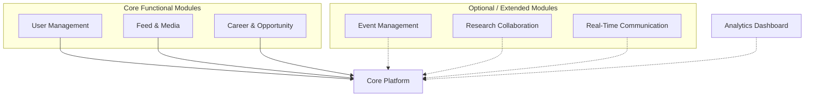

# 04 — Product Modularity Diagram

## 1. Overview

This document defines the modular design of the UniConnect platform, separating the system into a **Core Platform**, **Core Functional Modules**, **Optional / Extended Modules**, and an **Analytics Module**. Each module has clearly defined responsibilities and interacts with others only through the Core Platform.

## 2. Product Modularity Diagram



> **Legend**: Solid arrows = core dependencies (required). Dashed arrows = optional dependencies (extended features).

## 3. Core Platform

### 3.1 Purpose

The Core Platform provides shared infrastructure and foundational services required by all modules. It eliminates redundancy and centralizes cross-cutting concerns.

### 3.2 Responsibilities

| Responsibility | Description |
|----------------|-------------|
| Authentication | JWT / session-based user authentication |
| RBAC | Role-Based Access Control (Student, Alumni, Admin) |
| Database access | Centralized connection management |
| Logging & auditing | Unified application logging |
| Notification service | Shared notification dispatch |
| File storage abstraction | S3 / object storage interface |
| Error handling | Standardized error responses and validation |

### 3.3 Design Justification

- Security policies remain consistent across all modules
- Reduced duplication of authentication logic
- Easier updates to security or logging mechanisms
- Improved system stability

## 4. Core Functional Modules

### 4.1 User Management Module

| Aspect | Details |
|--------|---------|
| **Description** | Handles all user-related operations and identity management |
| **Features** | User registration, secure login, profile editing, role assignment (Student, Alumni, Admin), account status control (active/inactive) |
| **Dependencies** | Core authentication service, core database service |
| **Rationale** | Isolated to allow independent scaling and easier integration of additional roles in the future |

### 4.2 Feed & Media Module

| Aspect | Details |
|--------|---------|
| **Description** | Implements social interaction capabilities within the platform |
| **Features** | Text-based posts, feed viewing, basic engagement (reactions/comments), simplified media handling |
| **Dependencies** | User module (author identity), core storage service, core notification service |
| **Rationale** | Keeping media simple reduces implementation complexity while preserving extensibility for future enhancements (image/video support) |

### 4.3 Career & Opportunity Module

| Aspect | Details |
|--------|---------|
| **Description** | Supports job and internship posting and application management |
| **Features** | Job posting (by Alumni/Admin), internship posting, application submission, application tracking, status updates |
| **Dependencies** | User roles (authorization), notification service, database service |
| **Rationale** | Encapsulating career functionality allows future integration with external job APIs or AI-based matching without affecting other modules |

## 5. Optional / Extended Modules

These modules can be added **without altering the core system structure**.

### 5.1 Event Management Module

| Aspect | Details |
|--------|---------|
| **Features** | Event creation, RSVP tracking, event notifications, attendance monitoring |
| **Justification** | Allows department-level event coordination and enhances engagement |

### 5.2 Research Collaboration Module

| Aspect | Details |
|--------|---------|
| **Features** | Project creation, member invitations, document sharing, collaboration tracking |
| **Justification** | Encourages academic and professional collaboration between students and alumni |

### 5.3 Real-Time Communication Module

| Aspect | Details |
|--------|---------|
| **Features** | Direct messaging, chat sessions, online status indicators |
| **Technical Note** | Requires WebSocket or similar real-time protocol with a separate message handling service |
| **Justification** | Isolated due to different infrastructure requirements (persistent connections vs. stateless REST) |

## 6. Analytics Dashboard Module

| Aspect | Details |
|--------|---------|
| **Description** | Provides system insights and metrics |
| **Metrics** | Active users, post frequency, job application statistics, event participation rates |
| **Architecture Role** | Reads from all modules; does not directly control them; acts as a monitoring and reporting layer |

## 7. Module Interaction Strategy

The system follows a **centralized dependency model**:

- All modules communicate **through the Core Platform**
- Direct module-to-module dependency is **avoided**
- Shared services are **abstracted**

```
✅ Correct:  Feature Module → Core Platform → Database
❌ Avoid:    Feature Module → Another Module's internal logic
```

## 8. Design Principles Applied

| Principle | Application |
|-----------|-------------|
| **Separation of Concerns** | Each module addresses a specific responsibility |
| **High Cohesion** | Related functionalities are grouped within modules |
| **Low Coupling** | Modules interact through defined interfaces only |
| **Scalability** | Modules can be scaled independently (e.g., messaging service) |
| **Extensibility** | Optional modules can be added without restructuring the system |
