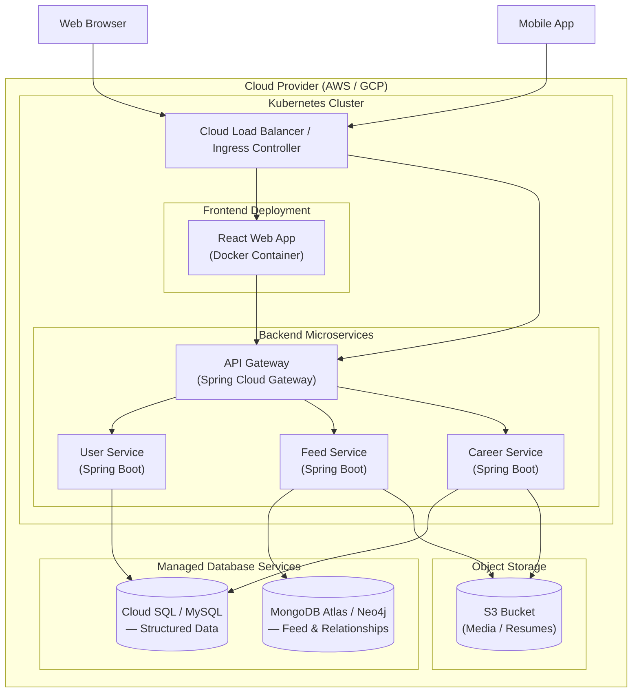

# 05 — Deployment Diagram (Cloud Architecture)

## 1. Overview

This document describes the cloud deployment architecture for the UniConnect platform. The system is containerized using **Docker**, orchestrated with **Kubernetes**, and hosted on a cloud provider (AWS / GCP). The design prioritizes independent scalability, high availability, and separation of concerns.

## 2. Deployment Diagram



## 3. Infrastructure Components

### 3.1 External Clients

| Client | Technology | Access Method |
|--------|------------|---------------|
| Web Browser | React SPA | HTTPS via Load Balancer |
| Mobile App | React Native | HTTPS via Load Balancer |

### 3.2 Kubernetes Cluster

| Component | Role |
|-----------|------|
| Cloud Load Balancer / Ingress Controller | Distributes incoming traffic to frontend and API Gateway pods |
| React Web App | Serves the static frontend; Docker container in its own pod |
| API Gateway (Spring Cloud Gateway) | Routes API requests, validates JWT, applies rate limiting |
| User Service (Spring Boot) | Handles authentication, profiles, roles |
| Feed Service (Spring Boot) | Manages posts and feed retrieval |
| Career Service (Spring Boot) | Manages jobs, internships, and applications |

### 3.3 Managed Database Services

| Database | Service | Used By | Data Types |
|----------|---------|---------|------------|
| MySQL | Cloud SQL (GCP) / RDS (AWS) | User Service, Career Service | Users, roles, jobs, applications |
| MongoDB / Neo4j | MongoDB Atlas / Neo4j Aura | Feed Service | Posts, media metadata, social relationships |

### 3.4 Object Storage

| Storage | Service | Used By | Content |
|---------|---------|---------|---------|
| S3 Bucket | AWS S3 / GCS | Feed Service, Career Service | Uploaded media files, resumes, documents |

## 4. Traffic Flow

```
Client (Web/Mobile)
    │
    ▼
Load Balancer / Ingress Controller
    │
    ├──► React Web App (static content)
    │         │
    │         ▼
    └──► API Gateway (:8080)
              │
              ├──► User Service (:8081) ──► MySQL
              ├──► Feed Service (:8082) ──► MongoDB/Neo4j, S3
              └──► Career Service (:8083) ──► MySQL, S3
```

## 5. Container Configuration

Each service runs as a Docker container managed by Kubernetes:

| Service | Base Image | Exposed Port | Replicas (Default) |
|---------|------------|-------------|-------------------|
| React Web App | `node:18-alpine` / nginx | 80 | 2 |
| API Gateway | `eclipse-temurin:17-jre` | 8080 | 2 |
| User Service | `eclipse-temurin:17-jre` | 8081 | 2 |
| Feed Service | `eclipse-temurin:17-jre` | 8082 | 2 |
| Career Service | `eclipse-temurin:17-jre` | 8083 | 2 |

## 6. Scalability Considerations

| Strategy | Description |
|----------|-------------|
| **Horizontal Pod Autoscaler (HPA)** | Kubernetes scales pod replicas based on CPU/memory utilization |
| **Independent service scaling** | During peak seasons (e.g., graduation), Career Service can receive more replicas without affecting Feed Service |
| **Managed databases** | Cloud SQL and MongoDB Atlas handle scaling, backups, and failover automatically |
| **Stateless services** | All microservices are stateless; session data is encoded in JWTs, enabling seamless horizontal scaling |

## 7. Networking

| Aspect | Configuration |
|--------|---------------|
| External access | HTTPS via Cloud Load Balancer |
| Internal communication | ClusterIP services within Kubernetes |
| DNS resolution | Kubernetes internal DNS (e.g., `user-service.default.svc.cluster.local`) |
| TLS termination | At the Load Balancer / Ingress Controller level |
