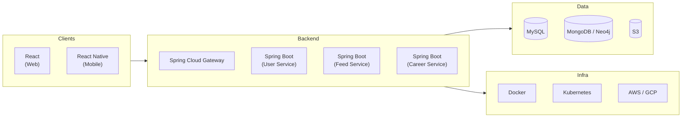

# 06 — Technology Stack

## 1. Overview

This document catalogs every technology, framework, and tool selected for the UniConnect platform, along with the rationale behind each choice.

## 2. Stack Summary

## 3. Frontend

| Technology | Version | Purpose | Justification |
|------------|---------|---------|---------------|
| React | 18.x | Web client SPA | Component-based UI, large ecosystem, efficient rendering |
| React Native | 0.72+ | Mobile client (iOS/Android) | Shared codebase with React; single API layer serves both clients |
| Axios | 1.x | HTTP client | Promise-based, interceptors for JWT injection |
| React Router | 6.x | Client-side routing (web) | Declarative routing for SPA navigation |

## 4. Backend

| Technology | Version | Purpose | Justification |
|------------|---------|---------|---------------|
| Java | 17 (LTS) | Service implementation language | Mature, strongly typed, enterprise-grade |
| Spring Boot | 3.x | Microservice framework | Convention over configuration, embedded server, rich ecosystem |
| Spring Cloud Gateway | 4.x | API Gateway | Built-in routing, JWT filter support, rate limiting |
| Spring Security | 6.x | Authentication & authorization | Seamless JWT integration, RBAC support |
| Spring Data JPA | 3.x | ORM for MySQL | Repository pattern, automatic query generation |
| Spring Data MongoDB | 4.x | MongoDB integration | Reactive and imperative support for document operations |

## 5. Databases

| Database | Type | Used By | Justification |
|----------|------|---------|---------------|
| MySQL 8.0 | Relational (SQL) | User Service, Career Service | Strong consistency, ACID transactions, relational integrity for user profiles and job applications |
| MongoDB 7.x | Document (NoSQL) | Feed Service | Flexible schema for posts, media metadata; efficient for feed retrieval patterns |
| Neo4j *(alternative)* | Graph | Feed Service | Optimized for relationship traversal (alumni-student connections); superior for multi-hop queries |

## 6. Object Storage

| Service | Provider | Used By | Content |
|---------|----------|---------|---------|
| AWS S3 / Google Cloud Storage | AWS / GCP | Feed Service, Career Service | Media uploads (images, videos), resumes, documents |

## 7. Infrastructure & DevOps

| Technology | Purpose | Justification |
|------------|---------|---------------|
| Docker | Containerization | Consistent environments across dev/staging/prod |
| Kubernetes | Container orchestration | Automated scaling, self-healing, rolling deployments |
| Helm | K8s package management | Templated, version-controlled deployments |
| GitHub | Source control | Version control, collaboration, CI/CD integration |
| GitHub Actions / Jenkins | CI/CD pipeline | Automated build, test, and deploy workflows |

## 8. Cloud Provider

| Provider | Service | Purpose |
|----------|---------|---------|
| AWS / GCP | EKS / GKE | Managed Kubernetes cluster |
| AWS / GCP | RDS / Cloud SQL | Managed MySQL instance |
| AWS / GCP | S3 / GCS | Object storage for media |
| MongoDB Atlas | DBaaS | Managed MongoDB instance |

## 9. Development Tools

| Tool | Purpose |
|------|---------|
| IntelliJ IDEA / VS Code | IDE for backend and frontend development |
| Postman | API testing and documentation |
| Docker Desktop | Local container management |
| Maven | Java build tool and dependency management |
| npm / yarn | JavaScript package management |

## 10. Communication Protocols

| Protocol | Usage |
|----------|-------|
| HTTPS / REST | All client–gateway and gateway–service communication |
| JSON | Standard request/response payload format |
| JWT (RFC 7519) | Stateless authentication tokens |
| WebSocket *(optional)* | Real-time messaging (if Chat module is implemented) |
