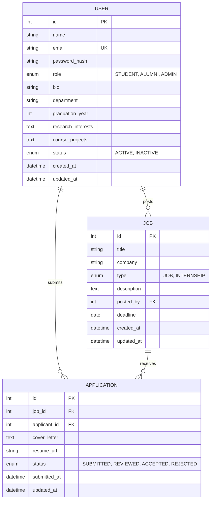
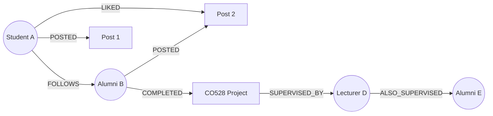

# 08 — Data Model

## 1. Overview

This document defines the data models for the UniConnect platform. The system uses **polyglot persistence** — MySQL for structured relational data and MongoDB (or Neo4j) for flexible document/graph data.

## 2. Entity-Relationship Diagram (MySQL)



## 3. MySQL Schema Definitions

### 3.1 `users` Table

| Column | Type | Constraints | Description |
|--------|------|-------------|-------------|
| `id` | `INT` | PK, AUTO_INCREMENT | Unique user identifier |
| `name` | `VARCHAR(100)` | NOT NULL | Full name |
| `email` | `VARCHAR(255)` | UNIQUE, NOT NULL | Login email |
| `password_hash` | `VARCHAR(255)` | NOT NULL | BCrypt-hashed password |
| `role` | `ENUM('STUDENT','ALUMNI','ADMIN')` | NOT NULL, DEFAULT 'STUDENT' | User role |
| `bio` | `TEXT` | NULLABLE | Profile biography |
| `department` | `VARCHAR(100)` | NULLABLE | Department affiliation |
| `graduation_year` | `INT` | NULLABLE | Year of graduation (alumni/student) |
| `research_interests` | `TEXT` | NULLABLE | JSON array of research interests |
| `course_projects` | `TEXT` | NULLABLE | JSON array of course project titles |
| `status` | `ENUM('ACTIVE','INACTIVE')` | DEFAULT 'ACTIVE' | Account status |
| `created_at` | `DATETIME` | DEFAULT CURRENT_TIMESTAMP | Account creation time |
| `updated_at` | `DATETIME` | ON UPDATE CURRENT_TIMESTAMP | Last update time |

### 3.2 `jobs` Table

| Column | Type | Constraints | Description |
|--------|------|-------------|-------------|
| `id` | `INT` | PK, AUTO_INCREMENT | Unique job identifier |
| `title` | `VARCHAR(200)` | NOT NULL | Job title |
| `company` | `VARCHAR(200)` | NOT NULL | Company or organization name |
| `type` | `ENUM('JOB','INTERNSHIP')` | NOT NULL | Opportunity type |
| `description` | `TEXT` | NOT NULL | Detailed job description |
| `posted_by` | `INT` | FK → `users.id`, NOT NULL | User who posted the job |
| `deadline` | `DATE` | NULLABLE | Application deadline |
| `created_at` | `DATETIME` | DEFAULT CURRENT_TIMESTAMP | Posting time |
| `updated_at` | `DATETIME` | ON UPDATE CURRENT_TIMESTAMP | Last update time |

### 3.3 `applications` Table

| Column | Type | Constraints | Description |
|--------|------|-------------|-------------|
| `id` | `INT` | PK, AUTO_INCREMENT | Unique application identifier |
| `job_id` | `INT` | FK → `jobs.id`, NOT NULL | Job being applied to |
| `applicant_id` | `INT` | FK → `users.id`, NOT NULL | Applicant user |
| `cover_letter` | `TEXT` | NULLABLE | Application cover letter |
| `resume_url` | `VARCHAR(500)` | NULLABLE | URL to uploaded resume in S3 |
| `status` | `ENUM('SUBMITTED','REVIEWED','ACCEPTED','REJECTED')` | DEFAULT 'SUBMITTED' | Application status |
| `submitted_at` | `DATETIME` | DEFAULT CURRENT_TIMESTAMP | Submission time |
| `updated_at` | `DATETIME` | ON UPDATE CURRENT_TIMESTAMP | Last update time |

**Constraint**: `UNIQUE(job_id, applicant_id)` — A user can apply to a job only once.

## 4. MongoDB Document Schemas (Feed Service)

### 4.1 `posts` Collection

```json
{
  "_id": "ObjectId",
  "authorId": 1,
  "authorName": "John Doe",
  "text": "Excited to share my final year project!",
  "mediaUrl": "https://s3.amazonaws.com/uniconnect/media/img123.jpg",
  "likes": [1, 3, 7],
  "comments": [
    {
      "userId": 3,
      "userName": "Jane Smith",
      "text": "Great work!",
      "createdAt": "2026-03-02T11:00:00Z"
    }
  ],
  "createdAt": "2026-03-02T10:30:00Z",
  "updatedAt": "2026-03-02T11:00:00Z"
}
```

| Field | Type | Description |
|-------|------|-------------|
| `_id` | ObjectId | Auto-generated document ID |
| `authorId` | Integer | Reference to MySQL `users.id` |
| `authorName` | String | Denormalized author name for fast reads |
| `text` | String | Post content |
| `mediaUrl` | String / null | S3 URL for attached media |
| `likes` | Array of Integer | List of user IDs who liked the post |
| `comments` | Array of Object | Embedded comment subdocuments |
| `createdAt` | DateTime | Post creation timestamp |
| `updatedAt` | DateTime | Last modification timestamp |

### 4.2 Indexes

| Collection | Index | Type | Purpose |
|------------|-------|------|---------|
| `posts` | `{ authorId: 1 }` | Single field | Fast author post lookups |
| `posts` | `{ createdAt: -1 }` | Single field (desc) | Feed chronological ordering |
| `posts` | `{ authorId: 1, createdAt: -1 }` | Compound | Efficient user feed queries |

## 5. Neo4j Graph Model (Alternative to MongoDB)

If Neo4j is used instead of MongoDB for the Feed Service:



**Node Labels**: `User`, `Post`, `Project`, `Lecturer`
**Relationship Types**: `FOLLOWS`, `POSTED`, `LIKED`, `COMMENTED_ON`, `COMPLETED`, `SUPERVISED_BY`

This model enables efficient multi-hop queries such as:
- *"Find alumni who completed the same project and now work in cloud DevOps"*
- *"Retrieve posts from users I follow, sorted by recency"*

## 6. Data Flow Between Stores

```
User registers → User Service → MySQL (users table)
User creates post → Feed Service → MongoDB (posts collection)
User applies for job → Career Service → MySQL (applications table)
User uploads resume → Career Service → S3 (object storage)
User uploads media → Feed Service → S3 (object storage)
```

MySQL and MongoDB are **not directly connected**. Cross-service data references use user IDs, with the API Gateway coordinating requests.
