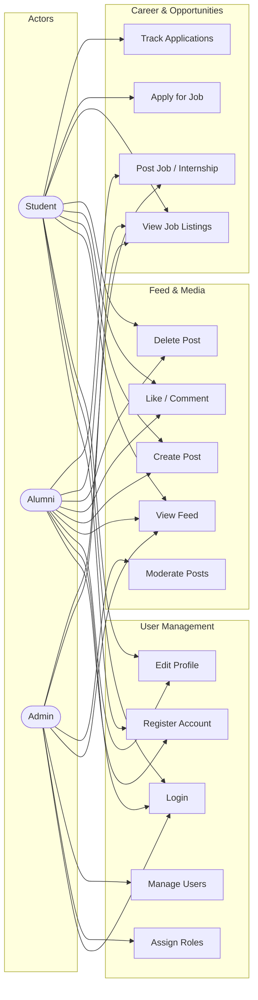

# 09 — Use Case Diagram

## 1. Overview

This document defines the actor–use-case relationships for the UniConnect platform. It covers all core modules (User Management, Feed & Media, Career & Opportunities) and identifies which actors interact with each use case.

## 2. Actors

| Actor | Description |
|-------|-------------|
| **Student** | Current student of the department; can view feed, apply for jobs, create posts |
| **Alumni** | Past student; can post jobs, share updates, mentor students |
| **Admin** | Platform administrator; can manage users, moderate content, and handle organization onboarding/posting workflows |

> External organizations (companies/academics) are represented through platform-managed workflows rather than a separate API role in this version.

## 3. Use Case Diagram

## 4. Use Case Descriptions

### 4.1 User Management

| ID | Use Case | Actors | Description |
|----|----------|--------|-------------|
| UC1 | Register Account | Student, Alumni | Create a new account with name, email, password, and role |
| UC2 | Login | All | Authenticate and receive a JWT for session access |
| UC3 | Edit Profile | Student, Alumni | Update bio, department, graduation year, research interests, course projects |
| UC4 | Assign Roles | Admin | Assign or change user roles (promote student to alumni, etc.) |
| UC5 | Manage Users | Admin | View user list, activate/deactivate accounts, moderate profiles |

### 4.2 Feed & Media

| ID | Use Case | Actors | Description |
|----|----------|--------|-------------|
| UC6 | View Feed | Student, Alumni, Admin | Browse the chronological feed of posts |
| UC7 | Create Post | Student, Alumni | Publish a text post (optionally with media attachment) |
| UC8 | Like / Comment | Student, Alumni | React to or comment on existing posts |
| UC9 | Delete Post | Student, Alumni | Remove own posts |
| UC10 | Moderate Posts | Admin | Remove inappropriate posts from any user |

### 4.3 Career & Opportunities

| ID | Use Case | Actors | Description |
|----|----------|--------|-------------|
| UC11 | View Job Listings | All | Browse available jobs and internships |
| UC12 | Post Job / Internship | Alumni, Admin | Create a new job or internship listing |
| UC13 | Apply for Job | Student | Submit an application with cover letter and resume |
| UC14 | Track Applications | Student | View status of submitted applications |

## 5. Access Control Matrix

| Use Case | Student | Alumni | Admin |
|----------|---------|--------|-------|
| Register Account | ✅ | ✅ | — |
| Login | ✅ | ✅ | ✅ |
| Edit Profile | ✅ | ✅ | — |
| Assign Roles | — | — | ✅ |
| Manage Users | — | — | ✅ |
| View Feed | ✅ | ✅ | ✅ |
| Create Post | ✅ | ✅ | — |
| Like / Comment | ✅ | ✅ | — |
| Delete Post | ✅ (own) | ✅ (own) | — |
| Moderate Posts | — | — | ✅ |
| View Job Listings | ✅ | ✅ | ✅ |
| Post Job / Internship | — | ✅ | ✅ |
| Apply for Job | ✅ | — | — |
| Track Applications | ✅ | — | — |
