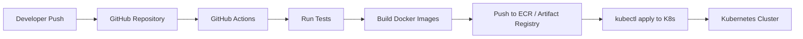

# 12 — Cloud Deployment Details

## 1. Overview

This document describes the cloud deployment strategy for the UniConnect platform, including infrastructure setup, database configuration, containerization, orchestration, CI/CD pipeline, and scalability considerations.

## 2. Cloud Provider

| Aspect | Primary Option | Alternative |
|--------|---------------|-------------|
| **Provider** | AWS | GCP |
| **Kubernetes** | Amazon EKS | Google GKE |
| **SQL Database** | Amazon RDS (MySQL) | Cloud SQL (MySQL) |
| **NoSQL Database** | MongoDB Atlas (cross-cloud) | MongoDB Atlas |
| **Object Storage** | Amazon S3 | Google Cloud Storage |
| **Container Registry** | Amazon ECR | Google Artifact Registry |

## 3. Infrastructure Architecture

```
┌─────────────────────────────────────────────────────────┐
│                   Cloud Provider (AWS / GCP)             │
│                                                         │
│  ┌───────────────────────────────────────────────────┐  │
│  │              Kubernetes Cluster (EKS / GKE)       │  │
│  │                                                   │  │
│  │  ┌─────────────────────────────────────────────┐  │  │
│  │  │        Ingress Controller / Load Balancer    │  │  │
│  │  └──────────────┬──────────────────────────────┘  │  │
│  │                 │                                  │  │
│  │     ┌───────────┴───────────┐                     │  │
│  │     │                       │                     │  │
│  │  ┌──▼──────────┐  ┌────────▼──────────┐          │  │
│  │  │ React App   │  │ API Gateway       │          │  │
│  │  │ (nginx)     │  │ (Spring Cloud)    │          │  │
│  │  │ :80         │  │ :8080             │          │  │
│  │  └─────────────┘  └────────┬──────────┘          │  │
│  │                            │                      │  │
│  │          ┌─────────────────┼─────────────┐        │  │
│  │          │                 │             │        │  │
│  │  ┌───────▼──────┐ ┌───────▼──────┐ ┌────▼──────┐│  │
│  │  │ User Service │ │ Feed Service │ │Career Svc ││  │
│  │  │ :8081        │ │ :8082        │ │ :8083     ││  │
│  │  └───────┬──────┘ └──┬────┬──────┘ └──┬───┬────┘│  │
│  │          │           │    │            │   │     │  │
│  └──────────┼───────────┼────┼────────────┼───┼─────┘  │
│             │           │    │            │   │         │
│  ┌──────────▼───────────▼────┼────────────▼───┼──────┐  │
│  │    MySQL (RDS / Cloud SQL)│                │      │  │
│  └───────────────────────────┘                │      │  │
│  ┌───────────────────────────┐                │      │  │
│  │    MongoDB Atlas           ◄───────────────┘      │  │
│  └───────────────────────────┘                       │  │
│  ┌───────────────────────────┐                       │  │
│  │    S3 / GCS (Object Store) ◄──────────────────────┘  │
│  └───────────────────────────┘                          │
└─────────────────────────────────────────────────────────┘
```

## 4. Containerization

### 4.1 Docker Images

Each service has its own Dockerfile:

| Service | Base Image | Build Tool | Artifact |
|---------|------------|------------|----------|
| React Web App | `node:18-alpine` → `nginx:alpine` | npm | Static build served by nginx |
| API Gateway | `eclipse-temurin:17-jre-alpine` | Maven | Spring Boot JAR |
| User Service | `eclipse-temurin:17-jre-alpine` | Maven | Spring Boot JAR |
| Feed Service | `eclipse-temurin:17-jre-alpine` | Maven | Spring Boot JAR |
| Career Service | `eclipse-temurin:17-jre-alpine` | Maven | Spring Boot JAR |

### 4.2 Example Dockerfile (Spring Boot Service)

```dockerfile
FROM eclipse-temurin:17-jre-alpine
WORKDIR /app
COPY target/user-service-1.0.0.jar app.jar
EXPOSE 8081
ENTRYPOINT ["java", "-jar", "app.jar"]
```

### 4.3 Example Dockerfile (React Frontend)

```dockerfile
FROM node:18-alpine AS build
WORKDIR /app
COPY package*.json ./
RUN npm ci
COPY . .
RUN npm run build

FROM nginx:alpine
COPY --from=build /app/build /usr/share/nginx/html
EXPOSE 80
```

## 5. Kubernetes Configuration

### 5.1 Namespace

All UniConnect resources are deployed in a dedicated namespace:

```
kubectl create namespace uniconnect
```

### 5.2 Deployment Strategy

| Service | Replicas | Strategy | Resource Limits |
|---------|----------|----------|-----------------|
| React App | 2 | RollingUpdate | CPU: 200m, Memory: 256Mi |
| API Gateway | 2 | RollingUpdate | CPU: 500m, Memory: 512Mi |
| User Service | 2 | RollingUpdate | CPU: 500m, Memory: 512Mi |
| Feed Service | 2 | RollingUpdate | CPU: 500m, Memory: 512Mi |
| Career Service | 2 | RollingUpdate | CPU: 500m, Memory: 512Mi |

### 5.3 Service Discovery

Services communicate using Kubernetes internal DNS:

| Service | Internal DNS |
|---------|--------------|
| API Gateway | `api-gateway.uniconnect.svc.cluster.local:8080` |
| User Service | `user-service.uniconnect.svc.cluster.local:8081` |
| Feed Service | `feed-service.uniconnect.svc.cluster.local:8082` |
| Career Service | `career-service.uniconnect.svc.cluster.local:8083` |

### 5.4 Ingress Configuration

```yaml
apiVersion: networking.k8s.io/v1
kind: Ingress
metadata:
  name: uniconnect-ingress
  namespace: uniconnect
  annotations:
    nginx.ingress.kubernetes.io/rewrite-target: /
spec:
  rules:
    - host: uniconnect.example.com
      http:
        paths:
          - path: /api
            pathType: Prefix
            backend:
              service:
                name: api-gateway
                port:
                  number: 8080
          - path: /
            pathType: Prefix
            backend:
              service:
                name: react-app
                port:
                  number: 80
```

## 6. Database Setup

### 6.1 MySQL (Managed)

| Parameter | Value |
|-----------|-------|
| **Service** | Amazon RDS / Cloud SQL |
| **Engine** | MySQL 8.0 |
| **Instance** | db.t3.micro (dev) / db.t3.medium (prod) |
| **Storage** | 20 GB SSD (auto-scaling enabled) |
| **Backup** | Automated daily snapshots, 7-day retention |
| **Access** | Private subnet, accessible only from K8s cluster VPC |

### 6.2 MongoDB (Managed)

| Parameter | Value |
|-----------|-------|
| **Service** | MongoDB Atlas (M0 free / M10 prod) |
| **Version** | 7.x |
| **Cluster** | Replica set (3 nodes for production) |
| **Access** | IP whitelisting for K8s cluster NAT gateway |
| **Indexes** | `{ authorId: 1 }`, `{ createdAt: -1 }` on posts collection |

### 6.3 Object Storage

| Parameter | Value |
|-----------|-------|
| **Service** | AWS S3 / Google Cloud Storage |
| **Bucket** | `uniconnect-media` |
| **Access** | IAM role attached to K8s service accounts |
| **Lifecycle** | Archive media older than 1 year to cold storage |

## 7. CI/CD Pipeline



### Pipeline Steps

| Step | Tool | Description |
|------|------|-------------|
| 1. Code push | Git / GitHub | Developer pushes to `main` or `release` branch |
| 2. Build & test | GitHub Actions | Compile, run unit tests, run integration tests |
| 3. Docker build | Docker | Build image for each changed service |
| 4. Push image | ECR / Artifact Registry | Tag and push image to container registry |
| 5. Deploy | kubectl / Helm | Apply updated manifests to Kubernetes cluster |
| 6. Health check | Kubernetes | Readiness and liveness probes verify deployment |

## 8. Scalability Configuration

### 8.1 Horizontal Pod Autoscaler

```yaml
apiVersion: autoscaling/v2
kind: HorizontalPodAutoscaler
metadata:
  name: career-service-hpa
  namespace: uniconnect
spec:
  scaleTargetRef:
    apiVersion: apps/v1
    kind: Deployment
    name: career-service
  minReplicas: 2
  maxReplicas: 6
  metrics:
    - type: Resource
      resource:
        name: cpu
        target:
          type: Utilization
          averageUtilization: 70
```

### 8.2 Scaling Strategy

| Scenario | Action |
|----------|--------|
| Normal load | 2 replicas per service |
| Peak registration period | User Service scales to 4 replicas |
| Graduation season (job rush) | Career Service scales to 6 replicas |
| Viral post | Feed Service scales to 4 replicas |

## 9. Monitoring & Observability

| Tool | Purpose |
|------|---------|
| Kubernetes Dashboard | Cluster health and pod status |
| CloudWatch / Cloud Monitoring | Infrastructure metrics and alerts |
| Application logs | Centralized logging via stdout → cluster log aggregator |
| Health endpoints | `/actuator/health` on each Spring Boot service |

## 10. Deployment Checklist

- [ ] Kubernetes cluster created (EKS / GKE)
- [ ] MySQL instance provisioned and accessible from cluster
- [ ] MongoDB Atlas cluster created with IP whitelisting
- [ ] S3 bucket created with IAM role for service accounts
- [ ] Docker images built and pushed to container registry
- [ ] Kubernetes secrets configured for database credentials
- [ ] Ingress controller deployed with TLS certificate
- [ ] All services deployed with readiness/liveness probes
- [ ] HPA configured for each service
- [ ] CI/CD pipeline tested with a sample push
